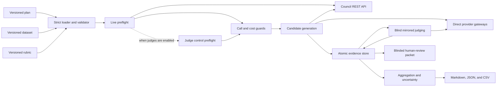

# Architecture

> **Document role:** current implementation boundary and evidence-flow reference.

## Boundary

The evaluator treats `llm-council` as a black box. It uses only these public API
operations:

1. `GET /api/council/catalog`
2. `GET /api/council/profiles/{profileId}/health`
3. `POST /api/council/sessions`
4. `POST /api/council/sessions/{sessionId}/run`

Direct baselines and judges bypass the council and call their configured provider
through a provider-neutral gateway. This prevents council orchestration from
contaminating the baseline and keeps the evaluation logic independently reviewable.

## Major components

| Area | Responsibility |
|---|---|
| Configuration | Strict YAML parsing, schema version checks, cross-file references, bounds, hashes. |
| Council client | Catalog snapshot, profile health, session creation, synchronous run. |
| Model gateways | Ollama HTTP plus Spring AI OpenAI, Anthropic, and Vertex AI Gemini adapters. |
| Execution | Sequential, resumable candidate generation plus bounded configurable judgment concurrency, with explicit live/billable consent. |
| Evidence store | One atomic JSON file per unit plus immutable manifest and preflight snapshot. |
| Checks | Non-blank, contains all/any/none, regex, forbidden regex, and maximum characters. |
| Judging | Anonymous A/B prompts, mirrored order, strict JSON response validation. |
| Statistics | Orientation collapse, judge majority, case-level Wilson-style intervals, unresolved sensitivity. |
| Reporting | Reliability, conditional quality, efficiency, check, judge-risk, and human results. |

## Execution lifecycle

`plan` parses all inputs, calls the live council catalog and health endpoints for
each enabled council variant, and calculates a conservative protocol estimate.
It performs no candidate or judge generation.

`run` repeats infrastructure preflight, verifies both file and command-line
acknowledgements, creates the manifest, and executes one persisted control pair per
enabled judge. A judge must return valid exact-contract JSON and select the
objectively correct control answer; otherwise the run stops before candidate work.
Passing control evidence is reused on resume. The smoke calls and configured
provider retries are included in call reservation. The runner then processes
candidates sequentially. Successful evidence is durable before the next unit
begins. Checks run immediately after each answer.
Judging begins after candidate generation. Independent judgment units may run with
bounded concurrency, but each attempt and final orientation is atomically stored in
its own path. Invalid responses can receive a bounded fresh call; every attempt is
retained separately before the final canonical orientation is written. Reports are
built from canonical stored evidence only. When no eligible comparison/judge units
exist, the runner explicitly reports that judging was skipped.

`resume` reloads the embedded inputs from the manifest, repeats live health checks,
and compares a normalized catalog fingerprint. It skips every already-present
answer and judgment file. A catalog mismatch stops the resume so two system
configurations cannot be silently mixed in one run.

`report` never calls a model. It reconstructs all metrics from the evidence tree.

`status` is also read-only. It reports the durable state plus answer, check-file,
and judgment counts, so it is safe to run from another terminal during evaluation.
Long calls emit periodic heartbeats; the launcher also reports build/skip state and
warns when a skipped-build JAR is stale. Progress output is observational and is not
part of the run evidence.

## Failure semantics

- A failed candidate remains an answer attempt and reduces answer rate.
- A pair is judge-eligible only when both variants produced a non-blank completed
  or partial answer.
- Invalid judge JSON is invalid evidence, never an implicit tie.
- A judge that cannot pass its control pair is rejected before candidate generation.
- A blank full-budget Ollama JSON response is `OUTPUT_EXHAUSTED`, retains usage,
  and is not retried as a transient transport failure.
- Conflicting mirrored orientations are position-unstable and unresolved.
- When enabled judges do not reach a strict majority, the pair is unresolved.
- An interruption changes `state.json`; completed atomic units remain resumable.
- A call interrupted after the provider accepted it but before evidence was written
  can be repeated on resume; no client can promise exactly-once external generation.
- Catalog drift is a hard failure on resume.
- Call-budget exhaustion stops before a unit whose reserved upper bound no longer
  fits. The actual count is reconciled after the unit completes.
- Cost exhaustion is detected after recorded calls. It is not a transactional
  reservation because final token use is unknown before generation.

## Security and operational choices

Plan files contain provider model identifiers and URLs, never API keys. Embedded
credentials in configured URLs are rejected. Cloud credentials come from the
environment or Application Default Credentials. Unknown YAML properties fail fast,
which makes configuration misspellings visible.

Candidate work is intentionally sequential. This is slower than unrestricted
parallel execution but improves comparability on a personal laptop and avoids
resource contention changing latency and failure rates between variants.

## Compatibility contract

This harness depends on the council catalog, health, session, and run response
shapes. Integration tests protect the expected HTTP contract with local servers.
If the council changes those public DTOs, update the client and tests together and
start new evaluation runs rather than resuming old ones.
